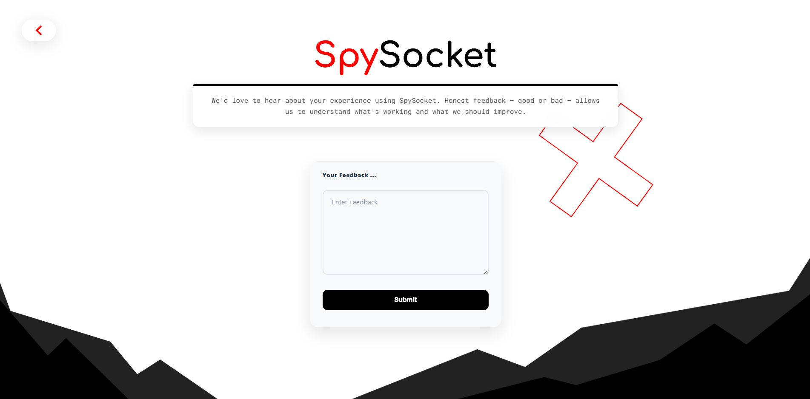
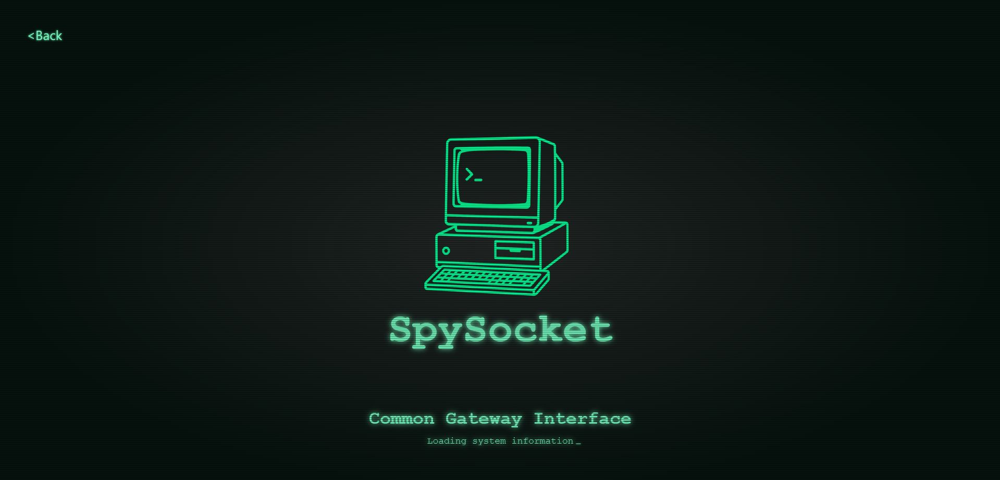
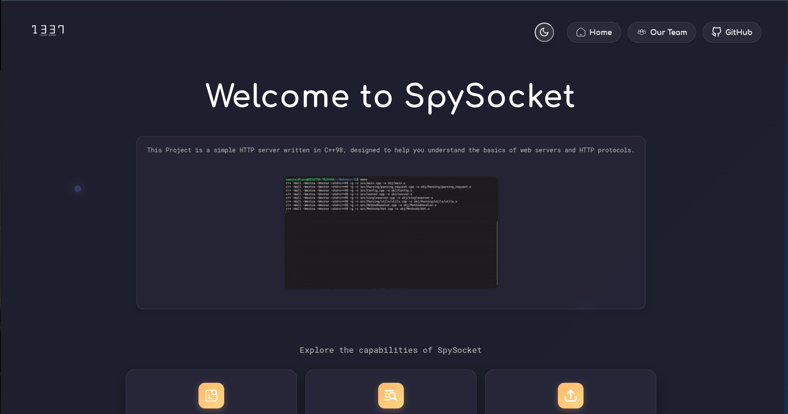
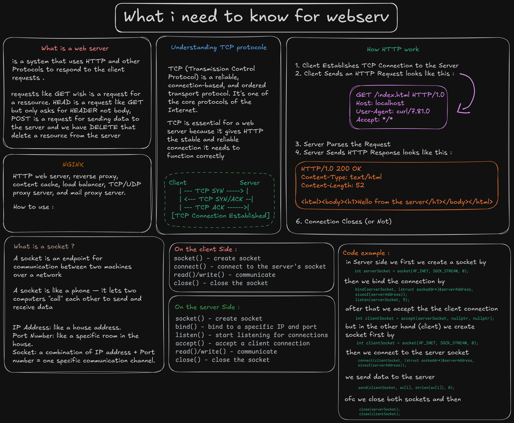
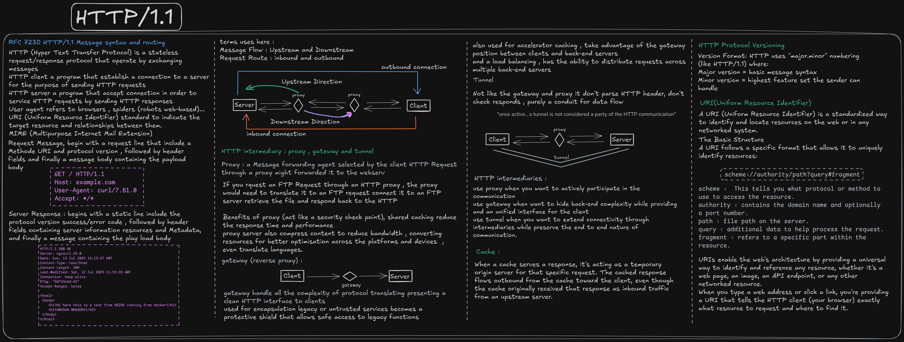
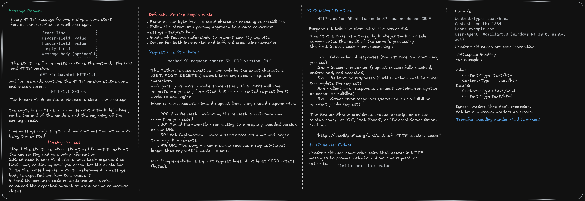
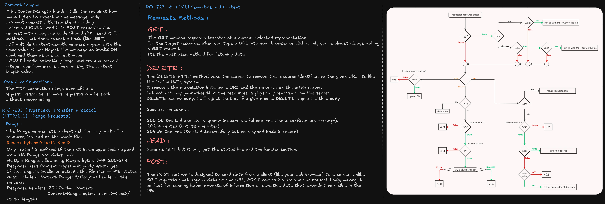

# Dashboard Preview








# And it's why URLs start with HTTP

Webserv is a simple HTTP server written in C++98, designed to help you understand the basics of web servers and HTTP protocols.

## Features

- Basic HTTP request handling
- Simple response generation
- Support for static files
- Configuration via a simple config file
- Logging of requests and errors
- Multi-CGI support

## Overall of What you need to know.



## HTTP/1.1

HTTP/1.1 is the foundation of data communication for the World Wide Web. It defines how messages are formatted and transmitted, and how web servers and browsers should respond to various commands.
- This are the resume of what you need in the RFC7230 and RFC7231.





## Handling the graceful shutdown (SIGINT)

The Server class leverages the Singleton design pattern to ensure a single global instance throughout the application’s lifecycle. Resource Acquisition Is Initialization (RAII) principles are applied to guarantee deterministic resource management, ensuring that resources such as sockets, file descriptors, and epoll instances are properly released when objects go out of scope.

Signal handling is implemented through the signal() function, which registers a handler for termination signals (SIGINT). When a signal is caught, the handler sets a termination flag that instructs the epoll event loop to exit gracefully. This mechanism allows the server to stop event processing in a controlled manner and trigger RAII-based cleanup of all allocated resources, avoiding memory leaks and dangling file descriptors.

## CGI (Common Gateway Interface)

CGI stand for Common gateway interface, its solve a problem, back in the days servers can only serve static website (HTML , IMAGES and fixed content)
but what i f i want to run something in my website like changing news or a weather stats...
CGI run that program and return that program output as a web page.

**How CGI works ?**

The server get a request and recognizes its for a CGI , setups the env variables containing all the request information, then the server launches the CGI program as a separate Process , and finally takes this output and send it back to the users browser.

**Environment Variables**:
CGI communicates through env variables , includes *REQUEST_METHOD* , *QUERY_STRING*, ...

CGI has its limitations since creates a new process for each request , today servers use more efficient alternatives like *FastCGI*, *WSGI* (for python).

**FastCGI, How its works ?**

For traditional CGI its create every time a new process , FastCGI solves this problem by keeping processes alive and reusing them, when it receive a request it looks at its pool of existing FastCGI processes.
The process manager it can dynamically adjust the number of processes based on the load
FastCGI dont have to run at the same machine as the webserver , because FastCGI communicate through its network protocol.


**--How Server knows its a CGI script and it needs to execute it ?**

in two ways , first treat the file like any other file checking , with its extension (``.cgi`` or ``.exe``), if the file end with those extension , than it will pass to the CGI to executed.
the second method is treating everything in that ``cgi-bin`` directory an executable.

**-- URL encoding**

```
http://example.com/cgi-bin/search.cgi/category/books?query=python&author=smith
```

``/cgi-bin/search.cgi``  ---> tells the server what program to execute.
``/category/books``      ---> provides additional context that the program can use.
``?query=python&author=smith`` ---> carries variable data.


**How i can implement it in my WEBSERV ?**

The CGI implementation follows a standard Unix process model with pipe-based communication.
1. Setting up CGI environment variables from the HTTP request (method, headers, paths, etc.).
	-- By encoding the URI , because we need the script path ,the query value and
	the data need for the script to run.
	--But we have a small issue , when we know its a CGI script, well there is a solution treats any file that inside the  ```cgi-bin``` folder a script.
	--we check for the interpreter for that script extension. or if has no extension or ```.cgi``` , we get it from the shebang in the script.
2. Creates two pipes - one for input to the CGI script and one for output from it. It forks a child process where the child redirects its STDIN/STDOUT to the pipes,
3. Executes the CGI script using `execve()` with the appropriate interpreter
4. The parent process manages the pipes, handles timeout scenarios using `select()` with interval-based counting.
5. Reads the CGI output in a non-blocking manner.


## HTTP Cookies

A cookie is a small piece of data set by the server and stored by the browser. The browser automatically sends matching cookies back to the server on subsequent requests.

Common uses: session management (login state), personalization, and analytics/ads tracking.

Request/response flow (simplified):

- Server response header: `Set-Cookie`
- Later client request header: `Cookie`

Set-Cookie format:

```
Set-Cookie: <cookie-name>=<cookie-value>[; <attribute>=<value>]...
```

Where:

- `<cookie-name>`: Identifier of the cookie
- `<cookie-value>`: String value to store
- Attributes (optional): scope, lifetime, and security controls

Common attributes:

- `Path=/app` – restricts which request paths send the cookie
- `Domain=example.com` – enables subdomain sharing
- `Max-Age=3600` or `Expires=Wed, 21 Oct 2015 07:28:00 GMT` – lifetime
- `Secure` – send only over HTTPS
- `HttpOnly` – inaccessible to JavaScript
- `SameSite=Strict|Lax|None` – cross-site cookie policy (if `None`, must also set `Secure`)

Notes:

- Each `Set-Cookie` sets a single cookie. Multiple cookies require multiple headers.
- Browsers typically limit each cookie to about 4096 bytes; total cookie limits vary by browser.

## Ressources used in this project

- [Beej’s Guide to Network Programming](https://beej.us/guide/bgnet/pdf/bgnet_a4_c_1.pdf)
- [RFC 7230 - HTTP/1.1 Message Syntax and Routing](https://datatracker.ietf.org/doc/html/rfc7230)
- [RFC 7231 - HTTP/1.1 Semantics and Content](https://datatracker.ietf.org/doc/html/rfc7231)
- [CGI Specification](https://datatracker.ietf.org/doc/html/rfc3875)
- [MDN Web Docs - HTTP Cookies](https://developer.mozilla.org/en-US/docs/Web/HTTP/Cookies)
- [NGINX-TEST-ENV](https://github.com/samurai0lava/NGINX-TESTING-ENV)
